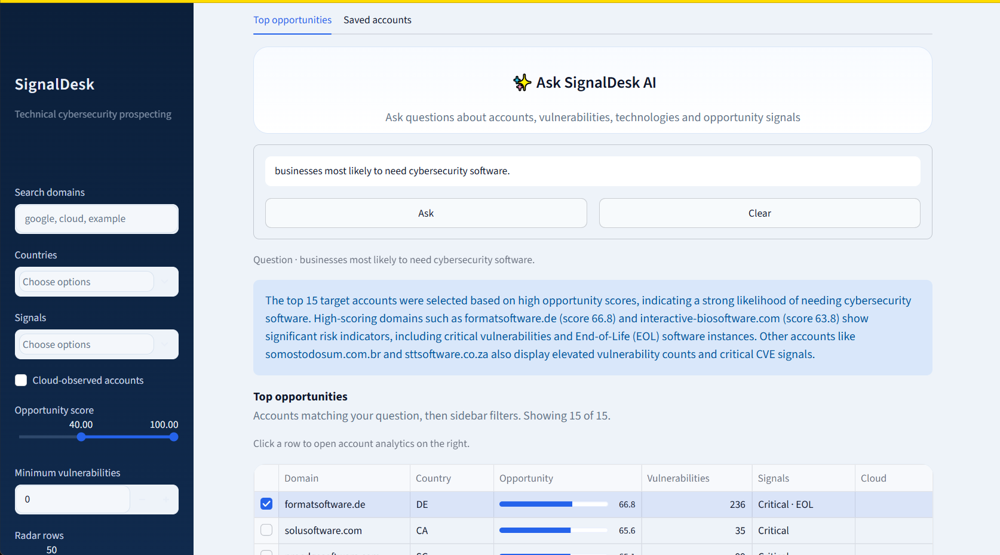
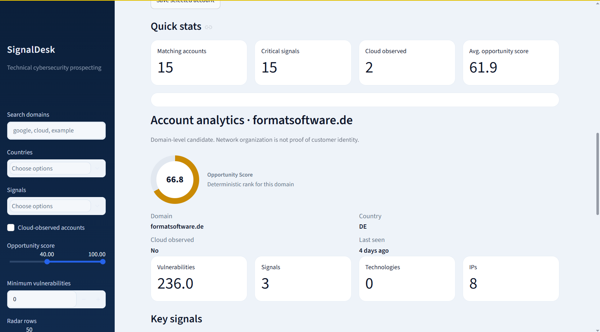
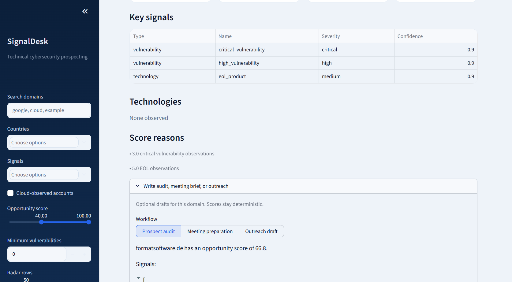
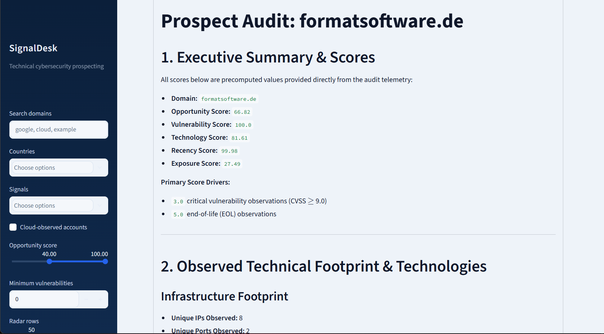
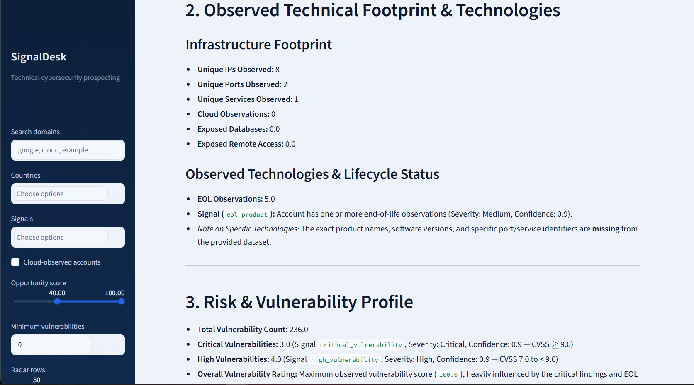

# AI Sales Intelligence

A streaming data pipeline for turning large internet-observation datasets into account-level sales signals.

## Pipeline

```text
Zstandard NDJSON -> normalized observations -> Parquet -> DuckDB accounts -> deterministic scores -> workflows
```

## Usage

Install dependencies in the project environment:

```powershell
python -m pip install -r requirements.txt
```
## UI Screenshots

### Dashboard


### Account Intelligence


### Sales Signals


### Account Details


### Workflow


The AI and Streamlit layers are deliberately isolated from ingestion and deterministic scoring.

## App

```powershell
streamlit run app.py
```

